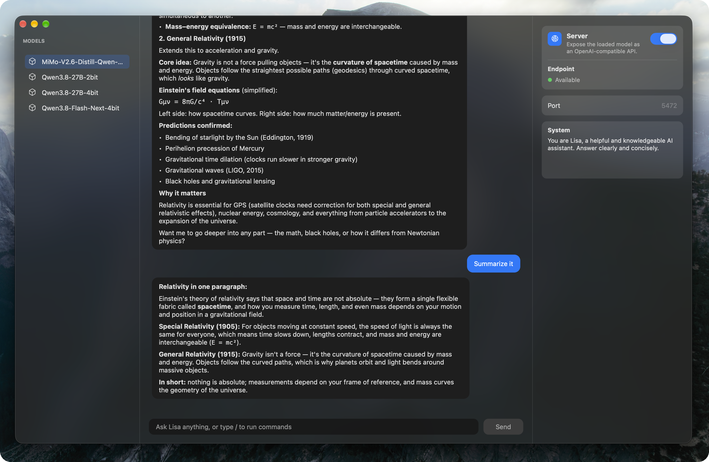

<p align="left">
  
  
  
  
</p>

# lisa



**LLM Inference for Silicon Architecture**

`lisa` is a **pure-Rust, from-scratch inference engine** for large language
models on Apple Silicon — no Python, no MLX, no tensor framework. The backend
talks to the Metal C API directly through `objc2` and compiles its `.metal`
shader sources at startup, so the whole stack ships as one native binary.

It is built on two open extension axes — **models** and **device backends** — so
the first model it implements is not the last:

- **Models.** Three today. `Qwen 3.8 Flash-Next` (125B total / A6B active): a
  hybrid gated-DeltaNet + full-attention decoder with a 512-expert sparse MoE, a
  per-layer n-gram embedding, and MTP speculative decoding on the M5's NAX
  tensor cores. `Qwen 3.8 27B`: a dense hybrid (full attention every 4th layer,
  gated DeltaNet elsewhere, no MoE/PLE) with output-gated attention and an MTP
  head. `Laya`: a non-generative typed-decision model (Metal or CPU). Bringing
  up another model is a `<name>/` module plus one `model_type` arm.
- **Devices.** Metal (GPU) and CPU, selected with `LISA_DEVICE` and defaulting
  to Metal when a device is present, CPU otherwise. Adding a backend is a
  `backend/<name>/` module plus one `Backend` variant.

On top of the engine: serial generation, multi-turn sessions, cohort / ragged /
continuous batching, and an **OpenAI-compatible HTTP server** —
`/v1/chat/completions` (streaming, tool calling, JSON mode / structured outputs,
logprobs, `n>1`, rate-limit headers), legacy `/v1/completions`, the
`/v1/responses` API (resource schema, streaming events, `previous_response_id`
chaining, background mode), and Anthropic `/v1/messages` +
`/v1/messages/count_tokens`. Decision models get `/v1/decisions`.

A **native macOS app** (`crates/lisa-ui`) ships on top: a model library,
streaming markdown chat, and the server runnable in-process.

It stays exact where it matters: **256/256** on the public long-copy golden,
serial and MTP `--depth 1..6`.

## Install

Build from source on any Apple Silicon Mac (Xcode 26 / Metal 4 toolchain):

```bash
cargo build --release      # -> target/release/lisa
```

Model weights are resolved from the Hugging Face cache; if a repo isn't cached,
`lisa` downloads it itself (Hub API + `curl`, resumable, `HF_TOKEN` honored), so
no separate download step is needed.

## Run

`--model` takes a Hugging Face repo id or a local directory:

```bash
lisa serve --model <hf-repo-id|local-dir> --addr 127.0.0.1:8000
```

```bash
curl http://localhost:8000/v1/chat/completions \
  -H "Content-Type: application/json" \
  -d '{
    "messages": [{"role": "user", "content": "Explain MTP speculation in one sentence."}],
    "max_tokens": 64
  }'
```

Any OpenAI-compatible client works: base URL `http://localhost:8000/v1`.

Typed decisions (Laya) use their own endpoint:

```bash
lisa decide --model convaiinnovations/laya \
  --state "We were billed twice; refund or we cancel." \
  --questions '{"department":{"type":"choice","instructions":"Which department?","criteria":{"billing":"payments","technical":"bugs","other":"misc"}}}'
```

`lisa decide` also takes `--device cpu`, `--head-max-len` / `--max-len`, and
temperature overrides (`--temperature`, `--temperature-by-options`). See
`AGENTS.md` §20.

## Desktop app

A native macOS front end ships in the workspace (`crates/lisa-ui`, AppKit via
`objc2`): a model library with background downloads, streaming multi-turn chat
with markdown/math rendering, and the OpenAI-compatible server runnable
in-process — chat and serving share the one engine thread. Run it in release
(debug hits loader alignment UB):

```bash
cargo build --release -p lisa-ui
./target/release/lisa-ui
# or bundle a Lisa.app:
./crates/lisa-ui/bundle.sh
```

## Architecture

```
crates/
  lisa-mlx/          tensor runtime: backend selection + the Metal backend
    src/backend/       Backend (metal|cpu); metal/ = runtime, Array/ops, JIT
    src/backend/metal/kernels/                 generic .metal (gemm, rope, sdpa, …)
    src/backend/metal/models/qwen4/kernels/    qwen4 .metal sources
  lisa-engine/       the inference library
    src/models/mod.rs  LanguageModel/DecisionModel traits + registry + resolution
    src/models/qwen4/  the Flash-Next implementation
    src/models/qwen3_5/ the Qwen 3.8 27B dense-hybrid implementation
    src/models/laya/   the Laya decision model (Metal + host forward)
    src/models/hf.rs   the Hugging Face hub downloader (Hub API + curl)
    src/core/          loading, quantization, norms, caches, generation,
                       session, batching, scheduler, sampling, tokenizer
  lisa-serve/        OpenAI-compatible HTTP server (+ decisions endpoint)
  lisa-ui/           the macOS desktop app (AppKit via objc2)
  lisa-cli/          the `lisa` binary
```

### The hybrid decoder

`full_attention_interval = 4` → **full causal attention** at layers 3, 7, …, 47,
**gated DeltaNet** elsewhere (36 of 48 layers).

- **GDN** — short causal conv + SiLU, q/k RMSNorm, a gated-delta recurrence with
  a Kahan-compensated **f32** state `[48,128,128]`, gated output RMSNorm.
- **Attention** — 24 Q heads / 2 KV heads, head_dim 256, `q|gate` projections,
  partial RoPE (f32 cos/sin computed on device).
- **MoE** — fp32 router, top-10 of 512 experts, gather-sort by expert, bf16
  combine; a shared expert adds `sigmoid(gate) · down(silu(g) · u)`.
- **PLE / n-gram** — a host hash + mmap'd shard table, gated embedding and a
  dilated causal conv, injected at layer 1.
- **MTP** — the embedded head drafts; the target verifies in one wide forward
  and the caches roll back to the committed prefix.

### Zero-framework Metal

The runtime binds `MTLCreateSystemDefaultDevice` and the Objective-C runtime
directly through `objc2` — no `metal-rs`. Kernels are compiled from embedded
`.metal` source at startup; weight shards are mmap'd into shared,
hazard-untracked GPU buffers. The NAX kernels use flattened Metal header
closures (`kernels/nax/`).

## Models & devices

A model is addressed by a **local directory or a Hugging Face repo id**; its
structure is read from the config and dispatched to the matching implementation
(`qwen4_exp`, `qwen3_5`, or `laya`). A device backend is chosen with
`LISA_DEVICE` (`metal` or `cpu`); when unset, Metal is used if a device is
present, otherwise CPU. Today: `qwen4_exp` and `qwen3_5` on Metal, and Laya on
Metal **or** CPU.

The runtime adapts to the GPU: on M5 it uses the MetalPerformancePrimitives
tensor ops (the NAX path); on M1–M4 it automatically falls back to the
non-NAX steel/vector kernels (generic GEMM, split-K quantized matmul, dense
attention), so the same binary runs on any Apple Silicon Mac.

Adding a model is a `<name>/` module plus one `model_type` arm; adding a backend
is a `backend/<name>/` module plus one `Backend` variant — see `AGENTS.md`
§3.1–3.2.

## Tests

```bash
cargo test                          # units (config/fixtures, kernels)
cargo build --release
./target/release/lisa smoke                            # fast-op + GDN parity
./target/release/lisa golden --model <dir> --golden <golden.json>          # 256/256
./target/release/lisa golden --model <dir> --golden <golden.json> --depth 5
```

## References

| Project | Role |
|---------|------|
| [candle](https://github.com/huggingface/candle) | concise Metal kernel cases (GEMM/GEMV, indexing) |
| [mlxfast-qwen38-125b-a6b-engine](https://github.com/Layr-Labs/mlxfast-qwen38-125b-a6b-engine) | correctness oracle and fused-kernel reference for this model (vendored under `reference/`) |
| [MTPLX](https://github.com/youssofal/MTPLX) | MTP speculative-decoding reference: block verify, context-copy, capture-commit rollback |
| [mlx-serve](https://github.com/ddalcu/mlx-serve) | native Apple-Silicon serving reference: selector split-select, shortlists, prefix cache |

Third-party kernel attribution is recorded in [NOTICE](NOTICE).

## License

MIT — see [LICENSE](LICENSE). Third-party kernel attribution is recorded in
[NOTICE](NOTICE); model weights and any upstream shaders are subject to their
own terms.