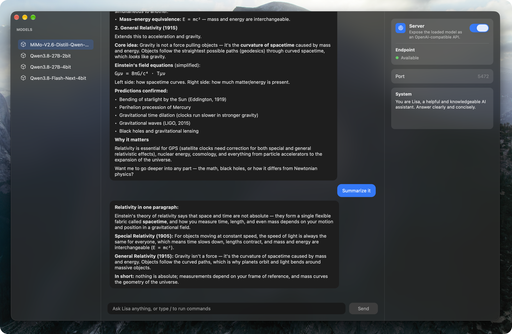

# lisa

**Local LLM inference for Apple Silicon. One native binary. No Python, no MLX, no framework.**



A from-scratch Rust + Metal inference engine for hybrid GDN + MoE + MTP
models — Qwen 3.8 27B and Flash-Next. Speculative decoding with an
expected-value controller, JIT-compiled Metal kernels, an OpenAI-compatible
server, and a native macOS app.

## Quick start

```bash
cargo build --release      # -> target/release/lisa
```

Run:

```bash
./target/release/lisa run --model agnosticeng/Qwen3.8-27B-4bit \
  --prompt "Explain multi-token prediction in two sentences."
```

Serve — any OpenAI-compatible client works, streaming included:

```bash
./target/release/lisa serve --model agnosticeng/Qwen3.8-27B-4bit --addr 127.0.0.1:8000
```

Or use the desktop app:

```bash
./target/release/lisa-ui
```

## Correctness

Correctness is tracked: **310/310** (27B) and **256/256** (Flash-Next)
bit-exact goldens, serial and speculative.

```bash
./target/release/lisa-bench golden --model agnosticeng/Qwen3.8-27B-4bit
```

## Why it's fast

- **MTP speculation with an EV controller** — the embedded head drafts, the
  target verifies in one wide forward, and a measured round-cost table picks
  the depth where speculation pays (serial when it doesn't).
- **A buffer pool that never sleeps** — weights, caches, and scratch buffers
  are managed to the MB; nothing superfluous stays resident.
- **JIT Metal kernels** compiled at runtime, NAX tensor-op paths on M5-class
  GPUs, split-K fallbacks on M1–M4.
- **Continuous batching** — per-slot attention over a packed KV cache.

## Docs

Engineering depth lives in [specs/](specs/) (contracts and measured
verdicts) and [AGENTS.md](AGENTS.md) (numerics contracts, read before
touching kernels).

## References

| Reference | What it is | Link |
| --- | --- | --- |
| mlx-fast | The Qwen MLX Challenge — the decode-throughput leaderboard for Qwen 3.8 27B | <https://www.yukon.org/mlxfast> |
| mlx-serve | Native LLM inference server for Apple Silicon (Zig backend, Swift macOS app; OpenAI- and Anthropic-compatible) | <https://github.com/ddalcu/mlx-serve> |
| mlx | Apple's array framework for Apple Silicon — source of the vendored Metal kernels | <https://github.com/ml-explore/mlx> |

## License

MIT — see [LICENSE](LICENSE). The Metal kernels are a port of the upstream
[MLX](https://github.com/ml-explore/mlx) kernel library, vendored for
provenance; the runtime and orchestration are original. Model weights are
subject to their own terms.
